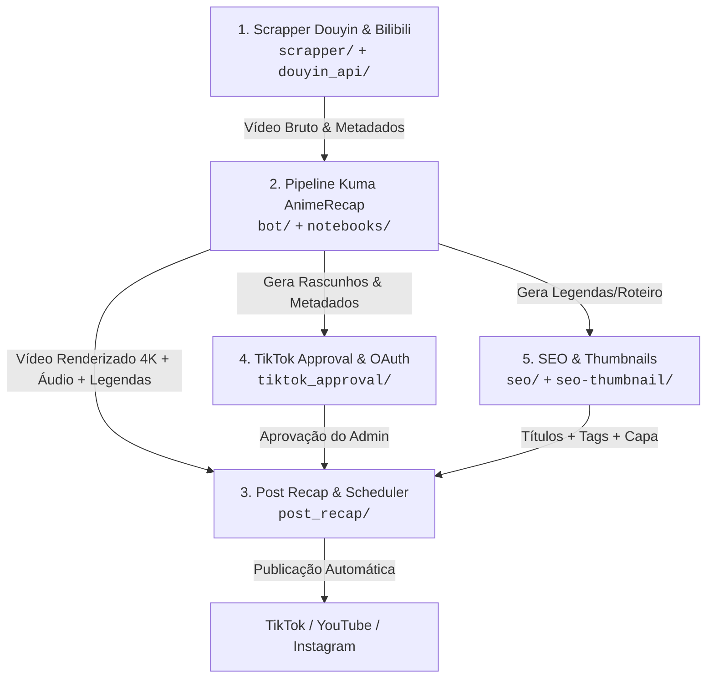

# 📘 Guia de Integração e Orquestração Multi-Projetos (Hugging Face Space)

Este repositório (`custodiio/anime-pipeline`) opera como um **Monorepo Integrado** hospedado em uma instância única no **Hugging Face Space** (`alehcrim/anime-pipeline`).

---

## 🎯 1. Visão Geral do Ecossistema e Ordem dos Módulos

O ecossistema é dividido em 5 módulos sequenciais e complementares:



### Detalhamento dos Módulos:
1. **Módulo 1 — `scrapper/` & `douyin_api/`**:
   - Realiza busca, scraping e download em alta qualidade de animes e dramas no Douyin e Bilibili.
   - Possui painel web próprio (FastAPI) e bot de busca no Telegram.
2. **Módulo 2 — `bot/` & `notebooks/` (Kuma Pipeline)**:
   - Bot principal no Telegram + Webhook server para orquestrar notebooks GPU no Kaggle via GitHub Actions.
   - Executa: Remoção de Marca d'água (`anime-watermark-remover`), Upscaling Real-ESRGAN (`anime-video-enhancer`), Tradução e Dublagem Gemini/Omni (`omni_main`, `omni_tts`, `omni_assemble`), Sincronização de Legendas `.ass` e Renderização Final (`anime-renderizador-kaggle` + `anime-merge-final`).
3. **Módulo 3 — `post_recap/`**:
   - Bot do Telegram e Worker de agendamento de publicações com fila de postagem programada.
4. **Módulo 4 — `tiktok_approval/`**:
   - Backend FastAPI para gerenciamento de contas do TikTok, fluxo OAuth2 e aprovação humana de vídeos antes do disparo.
5. **Módulo 5 — `seo/` & `seo-thumbnail/`**:
   - Backend Node.js Express e gerador de capas que cria títulos virais, tags, descrições e thumbnails otimizadas.

---

## ⚡ 2. Como os Projetos Rodam Simultaneamente

No Hugging Face Space, a execução ocorre através de um **Orquestrador Central Único** localizado em [`app.py`](file:///d:/Applications/AnimeRecap/app.py):

1. **Ponto de Entrada**: O Space inicializa executando `python app.py`.
2. **Isolamento por Threads e Subprocessos**:
   - `init_system()` dispara cada módulo em sua própria thread (`daemon=True`) ou subprocesso isolado (`subprocess.Popen`).
   - Se um módulo sofrer uma falha temporária ou reiniciar, os outros **não são afetados**.
3. **Mapeamento e Isolamento de Portas**:
   - **Porta 7860** (Principal / Externa): **Gradio Dashboard** e Health Check do Space.
   - **Porta 8080** (Interna): Webhook Server do Kuma Recap (recebe callbacks do Kaggle e GitHub Actions).
   - **Porta 5555** (Interna): Evil0ctal Douyin Download API (FastAPI em subprocesso).
   - **Porta 5556** (Interna): Douyin Scrapper FastAPI & Web Panel.
   - **Porta 8000** (Interna): TikTok Approval API (FastAPI).
   - **Porta 3333** (Interna): SEO Anime Recap (Node.js Express).
4. **Roteamento ASGI Unificado no Gradio**:
   - O `app.py` possui a função `inject_api_routes(target_app)` que monta automaticamente as rotas dos sub-apps FastAPI diretamente na aplicação principal do Gradio na porta 7860, permitindo acesso web transparente.

---

## 📜 3. Regras Globais Obrigatórias (Para Qualquer Agente)

> [!IMPORTANT]
> 1. **Idioma**: Todas as respostas e documentações devem ser exclusivamente em `pt-br`.
> 2. **Segurança de Chaves e Credenciais**: **NUNCA** insira chaves de API, senhas ou tokens diretamente no código-fonte. Sempre utilize variáveis de ambiente via `.env` ou Hugging Face Space Secrets com `os.getenv("NOME_DA_VARIAVEL")`.
> 3. **Controle de Login e Aprovação de Usuários**: Qualquer projeto/módulo que contenha tela de login ou autenticação de usuários **DEVE** verificar aprovação manual no banco de dados (`is_approved = true` / `approved_by_admin = true`). **NUNCA** exiba o conteúdo restrito antes dessa validação.

---

## 🛠️ 4. Passo a Passo Prático para Adicionar um Novo Módulo

Quando for adicionar ou atualizar um novo projeto nesta mesma instância:

### 1. Criar a Pasta do Novo Módulo
Crie uma pasta dedicada na raiz do repositório (exemplo: `novo_modulo/`). Mantenha todo o código interno nessa pasta.

### 2. Adicionar Dependências em `requirements.txt`
Se o novo módulo exigir novos pacotes Python:
- Abra [`requirements.txt`](file:///d:/Applications/AnimeRecap/requirements.txt).
- **Adicione** os novos pacotes ao final.
- **NÃO** remova pacotes existentes para não quebrar os outros módulos.

### 3. Conectar ao Banco de Dados Compartilhado (`shared/`)
Utilize a infraestrutura já configurada em `shared/`:
- Use `from shared.db import get_db_connection, query_db` para consultas.
- Para criar novas tabelas automaticamente na inicialização, adicione o comando `CREATE TABLE IF NOT EXISTS ...` no arquivo [`shared/schema_init.py`](file:///d:/Applications/AnimeRecap/shared/schema_init.py).

### 4. Registrar o Módulo no `app.py`
Edite o arquivo [`app.py`](file:///d:/Applications/AnimeRecap/app.py):
1. Adicione a chave de status no dicionário `SERVICE_STATUS`:
   ```python
   SERVICE_STATUS["Nome do Novo Módulo"] = "🔄 Aguardando..."
   ```
2. Crie a função de inicialização com loop resiliente:
   ```python
   def start_novo_modulo_service():
       try:
           # Inicialização do serviço ou FastAPI
           SERVICE_STATUS["Nome do Novo Módulo"] = "✅ Online"
           # loop ou execução do worker
       except Exception as e:
           logger.error(f"[NOVO MODULO] Erro: {e}")
           SERVICE_STATUS["Nome do Novo Módulo"] = f"❌ Erro ({e})"
   ```
3. Registre na lista `services` da função `init_system()`:
   ```python
   services = [
       ("Kuma Recap", start_kuma_service),
       ("Evil0ctal Douyin API", start_evil0ctal_api),
       ("Scrapper Douyin", start_scrapper_service),
       ("Post Recap", start_postrecap_service),
       ("TikTok Approval", start_tiktok_approval_service),
       ("SEO Anime Recap", start_seo_service),
       ("Novo Modulo", start_novo_modulo_service), # <--- Adicione aqui
   ]
   ```
4. Se o módulo possuir rotas FastAPI que devam ser expostas na URL principal do Space, adicione-o na função `inject_api_routes(target_app)` em `app.py`.

### 5. Fazer o Deploy Seguro
- Envie as alterações para o repositório Git:
  ```bash
  git add .
  git commit -m "Adiciona Novo Módulo ao ecossistema"
  git push origin main
  ```
- Sincronize com o Hugging Face Space executando o script de sincronização:
  ```bash
  python scratch/deploy_module2_and_space.py
  ```

---

## 🗄️ 5. Estrutura de Arquivos de Referência

```text
AnimeRecap/
├── app.py                      # 🚀 Orquestrador Mestre no HF Space (Gradio + Multi-Threads)
├── requirements.txt            # 📦 Dependências globais unificadas
├── shared/                     # 🔗 Conexões de banco Neon, schemas e helpers globais
│   ├── db.py
│   ├── models.py
│   └── schema_init.py
├── scrapper/                   # 📥 Módulo 1: Scraper Douyin/Bilibili
├── douyin_api/                 # 📥 Módulo 1: Evil0ctal API de Download
├── bot/                        # 🎬 Módulo 2: Kuma Pipeline Controller & Telegram Bot
├── notebooks/                  # 📓 Módulo 2: Notebooks compilados para Kaggle
├── post_recap/                 # 📤 Módulo 3: Post Recap & Agendador
├── tiktok_approval/            # 📱 Módulo 4: TikTok Approval & OAuth
├── seo/                        # 🏷️ Módulo 5: SEO & Geração de Metadados (Node.js)
└── videorender-frontend/       # 💻 Frontend do Editor de Vídeo (React/Vite na Vercel)
```
